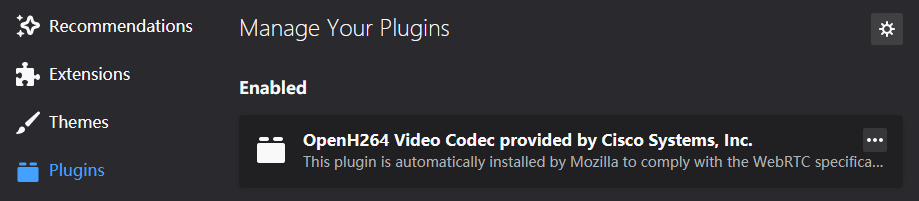
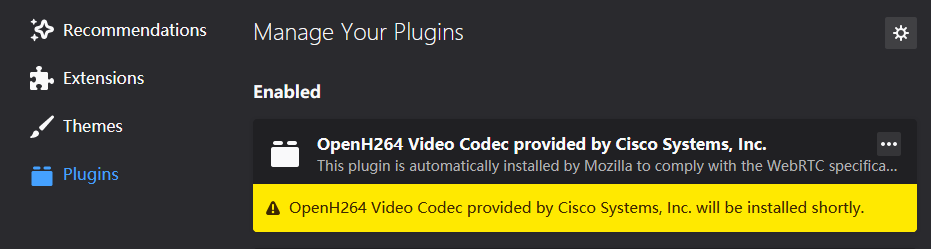

# 武汉安防 dashboard 配置需求

## 一、CPU

- 最低配置（参考）： AMD Athlon 64 X2 Dual Core 5000+ 2.6 GHz（跑分844）

## 二、显示器

- 分辨率至少: 1920px * 1080px

## 三、显卡

- 可无显卡
- 若有显卡，可有效降低 CPU 负载

## 四、操作系统

|  | Windows | Mac OS X | Linux | Android | iOS | Windows Phone |
|:--------:|:-------:|:--------:|:-----:|:-------:|:---:|:-------------:|
|   64位   |    ✔️    |     ✔️    |   ✔️   |    ✔️    |  ✔️  |       ✔️       |
|   32位   |    ✔️    |     ✔️    |   ✔️   |    ✔️    |  ✔️  |               |

## 五、浏览器

**推荐使用 Firefox (61.0 及以上版本)。**

为了实现以 WebRTC 技术播放视频，需要额外安装解码器 [Openh264](https://github.com/cisco/openh264)：

- 方法一：自动安装（推荐）

1. 打开 Firefox，:warning: 确保成功联网（必要时设置代理）；
2. 等待几分钟，Firefox 将会自动完成安装。
    
- 方法二：手动安装

1. :warning: 确保 Firefox 至少运行过一次（需要完成一些初始化操作）；
2. 下载文件 [dashboard-configuration-requirements-master.zip](http://10.161.32.68/F1054460/dashboard-configuration-requirements/-/archive/master/dashboard-configuration-requirements-master.zip) 到任意位置并解压；
3. 关闭正在运行的 Firefox，双击运行解压后文件夹内的 `install_plugin.bat` 以完成安装。

**检查解码插件是否安装成功:**

打开 Firefox，选择右上角『Open menu』->『A dd-ons』->『Plugins』，然后参考下图：

已安装

未安装

其它浏览器，如 Chrome (较新版本)，也能使用，但是视频加载及播放可能不稳定。
